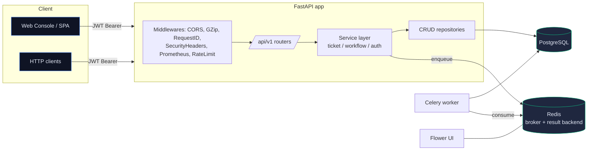

# VanguardOps

> Plataforma de automatización para soporte TI: inventario de activos, triage inteligente de tickets, ejecución asíncrona de workflows y trazabilidad de auditoría inmutable.

[](https://github.com/0xvanguard/VanguardOps/actions/workflows/ci.yml)


VanguardOps es una API y consola operativa de nivel empresarial que centraliza la
gestión de incidentes TI: registra activos, recibe tickets, calcula prioridad y SLA
según reglas, ejecuta workflows en segundo plano (Celery + Redis) y produce un
log de actividad auditable de cada paso.

---

## ✨ Características principales

| Capacidad | Descripción |
|-----------|-------------|
| **Triage automático** | Cálculo de prioridad y SLA basado en severidad y categoría del incidente. |
| **Ruteo a equipos** | Asignación inicial automática (L1 Service Desk, L2 Network, L3 Security, etc.). |
| **Workflows asíncronos** | Celery + Redis ejecutan tareas (reset de contraseña, ping/traceroute, diagnósticos) con reintentos y prevención de duplicados. |
| **Auditoría inmutable** | Cada evento de dominio (creación, transición de estado, ejecución, fallo) queda registrado en `activity_logs`. |
| **Autenticación JWT + RBAC** | Tres roles (`admin`, `operator`, `viewer`) con jerarquía. Bcrypt para passwords, refresh tokens, `jti` por token. |
| **State machine de tickets** | Transiciones validadas (`OPEN → IN_PROGRESS → RESOLVED → CLOSED`), no se permiten saltos arbitrarios. |
| **Errores RFC 7807** | Respuestas `application/problem+json` con `type`, `title`, `status`, `detail`, `code` y `request_id`. |
| **Observabilidad first-class** | `/livez`, `/readyz`, `/metrics` (Prometheus), logs estructurados JSON, `X-Request-ID` por request. |
| **Migraciones gestionadas** | Alembic con naming convention para nombres deterministas de constraints. |
| **Consola web integrada** | SPA en vanilla JS con login JWT, formularios CRUD, timeline en vivo. |
| **Hardening de producción** | Multi-stage Docker, usuario no-root, healthchecks, security headers, CORS, rate limiting (slowapi), GZip. |

---

## 🏛️ Arquitectura



### Capas (separación estricta de responsabilidades)

```
app/
├── api/
│   ├── deps.py          # Inyección: DB session, JWT, RBAC, paginación
│   ├── router.py        # Composición de routers /api/v1
│   └── endpoints/       # Una ruta = una decisión de transporte (parsear + delegar)
├── core/
│   ├── config.py        # Settings tipados (pydantic-settings)
│   ├── security.py      # JWT issue/decode, bcrypt, Role enum, jerarquía
│   ├── exceptions.py    # Jerarquía de errores de dominio (mapean a RFC 7807)
│   ├── error_handlers.py# Handlers FastAPI → application/problem+json
│   ├── middleware.py    # RequestID + Security headers
│   ├── observability.py # Prometheus middleware
│   └── logging.py       # structlog (JSON / console) con contextvars
├── crud/                # Repositorios SQLA 2.0, sin lógica de negocio
├── models/              # ORM con TimestampMixin y typing moderno
├── schemas/             # Validación de entrada/salida (Pydantic v2)
├── services/            # Lógica de dominio: triage, state machine, dispatch
├── workers/             # Celery app + tareas (función pura + wrapper)
├── static/              # Frontend SPA
└── main.py              # Application factory + lifespan
```

> **Regla de oro:** los endpoints son delgados (parsear y delegar). La lógica vive en `services/`. La persistencia vive en `crud/`. Los servicios nunca importan FastAPI; los workers nunca importan endpoints.

---

## 🚀 Quick start

### Opción 1 · Docker Compose (recomendado)

```bash
cp .env.example .env
# Edita .env y al menos cambia SECRET_KEY (genera uno con):
#   python -c "import secrets; print(secrets.token_urlsafe(64))"

docker compose up -d --build
```

Servicios disponibles:

| Servicio | URL | Notas |
|----------|-----|-------|
| API + consola web | <http://localhost:8000/> | Frontend con login |
| Documentación interactiva (Swagger) | <http://localhost:8000/docs> | OpenAPI 3.1 |
| Documentación alternativa (ReDoc) | <http://localhost:8000/redoc> | |
| Liveness probe | <http://localhost:8000/livez> | |
| Readiness probe | <http://localhost:8000/readyz> | Verifica DB y Redis |
| Métricas Prometheus | <http://localhost:8000/metrics> | |
| Flower (perfil monitoring) | <http://localhost:5555> | `docker compose --profile monitoring up` |
| pgAdmin (perfil admin) | <http://localhost:5050> | `docker compose --profile admin up` |

**Credenciales bootstrap** (creadas automáticamente al primer arranque):

```
admin@vanguardops.local / ChangeMe!2024
```

> Cámbialas inmediatamente vía `BOOTSTRAP_ADMIN_*` en `.env` o creando otro admin con `POST /api/v1/auth/register`.

### Opción 2 · Desarrollo local (sin Docker)

```bash
python -m venv .venv && source .venv/bin/activate
pip install -r requirements.txt

# Aplicar migraciones (SQLite por defecto)
alembic upgrade head

# Levantar API con hot-reload
make dev

# En otra terminal: worker
make worker
```

---

## 🔐 Autenticación

VanguardOps usa **OAuth 2.0 password grant + JWT**. Flujo típico:

```bash
# 1) Login
curl -X POST http://localhost:8000/api/v1/auth/login \
  -H "Content-Type: application/json" \
  -d '{"email":"admin@vanguardops.local","password":"ChangeMe!2024"}'

# Respuesta: { "access_token": "...", "refresh_token": "...", "expires_in": 3600 }

# 2) Llamar endpoints protegidos
curl http://localhost:8000/api/v1/tickets/ \
  -H "Authorization: Bearer <ACCESS_TOKEN>"

# 3) Refrescar token cuando expire
curl -X POST http://localhost:8000/api/v1/auth/refresh \
  -H "Content-Type: application/json" \
  -d '{"refresh_token":"..."}'
```

### Matriz de permisos

| Acción | viewer | operator | admin |
|--------|:---:|:---:|:---:|
| Listar / leer recursos | ✅ | ✅ | ✅ |
| Crear/actualizar tickets, assets, workflows | ❌ | ✅ | ✅ |
| Crear / desactivar usuarios | ❌ | ❌ | ✅ |

---

## 🧪 Testing

```bash
make test          # Suite completa (60 tests)
make test-cov      # Con reporte de cobertura HTML
make lint          # ruff
make format        # auto-formato
make check         # lint + tests
```

Estrategia:

* **Aislamiento por test** mediante un patrón de `connection.begin() + SAVEPOINT` que se hace rollback al final del test.
* **factory-boy** para construir entidades sin acoplarse al esquema.
* **JWT real** en cada test (no se mockea autenticación).
* **Tests de unidad** para reglas puras (`tests/test_rules.py`).
* **Tests de integración** vía `TestClient` con override de `get_db`.

---

## 📦 Migraciones

```bash
# Aplicar todas las migraciones
make migrate

# Crear nueva revisión a partir de cambios en los modelos
make revision m="add foo to bar"
```

Ver [`docs/adr/004-alembic-migrations.md`](docs/adr/004-alembic-migrations.md).

---

## 📈 Observabilidad

| Endpoint | Propósito |
|----------|-----------|
| `GET /livez` | Liveness probe — ¿el proceso está vivo? Ideal para Kubernetes. |
| `GET /readyz` | Readiness probe — ¿DB y Redis responden? Quita el pod del balanceador si falla. |
| `GET /metrics` | Métricas Prometheus (`http_requests_total`, `http_request_duration_seconds`). |
| `X-Request-ID` | Header inyectado por el middleware; se propaga en logs y errores. |

Logs en formato **JSON estructurado** (configurable a `console` para dev). Cada línea incluye `request_id`, `method`, `path`, `status_code`, `duration_ms`.

---

## 🐛 Errores RFC 7807

Todas las respuestas de error usan `application/problem+json`:

```json
{
  "type": "https://errors.vanguardops.dev/invalid_state_transition",
  "title": "Invalid State Transition",
  "status": 409,
  "detail": "Cannot transition ticket from CLOSED to OPEN",
  "code": "invalid_state_transition",
  "instance": "/api/v1/tickets/42",
  "request_id": "01HX...",
  "current_status": "CLOSED",
  "requested_status": "OPEN",
  "allowed_transitions": []
}
```

Códigos estables (`code`) para que clientes ramifiquen sin parsear strings:
`ticket_not_found`, `asset_not_found`, `workflow_not_found`, `invalid_state_transition`,
`invalid_credentials`, `forbidden`, `validation_error`, `user_already_exists`,
`rate_limited`, `internal_error`, etc.

---

## 🛡️ Hardening

* Imagen Docker **multi-stage** sin compiladores en runtime, usuario no-root (`vanguard:1001`), `tini` como PID 1.
* Healthcheck integrado (`/livez`).
* Headers de seguridad: `X-Content-Type-Options`, `X-Frame-Options: DENY`, `Referrer-Policy`, `Permissions-Policy`.
* CORS configurable por env (`CORS_ORIGINS`).
* Rate limiting con `slowapi` (configurable por env).
* `SECRET_KEY` validado con mínimo 32 caracteres y obligatorio en producción.
* Passwords con bcrypt (12 rounds por defecto).
* Tokens con `jti` único por emisión + verificación de `exp` y `type` (access vs refresh).
* `pool_pre_ping=True` y `pool_recycle=1800` en SQLAlchemy contra desconexiones silenciosas de PostgreSQL.

---

## 📚 Documentación adicional

* [`docs/adr/`](docs/adr/) — Architecture Decision Records.
* [`docs/api.md`](docs/api.md) — Resumen del contrato HTTP.
* [`CONTRIBUTING.md`](CONTRIBUTING.md) — Cómo abrir un PR, convenciones de commit, pre-commit hooks.

---

## 🛠️ Stack técnico

| Capa | Tecnología |
|------|-----------|
| Lenguaje | Python 3.12 |
| Web framework | FastAPI 0.110+ (Pydantic v2) |
| ORM | SQLAlchemy 2.0 (typed `Mapped[...]`) |
| Migraciones | Alembic 1.13 |
| Async tasks | Celery 5.3 + Redis 7 |
| BD | PostgreSQL 16 (prod) / SQLite (tests) |
| Auth | PyJWT + passlib[bcrypt] |
| Logging | structlog |
| Métricas | prometheus-client |
| Rate limit | slowapi |
| Tests | pytest 8 + factory-boy + freezegun |
| Lint / format | ruff |
| Container | Docker (multi-stage) + docker compose con perfiles |

---

## 📄 Licencia

[MIT](LICENSE)
